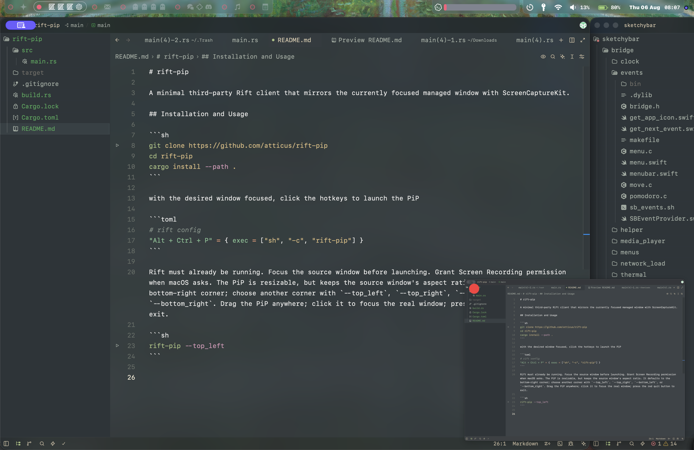

# rift-pip

A minimal third-party Rift client that mirrors the currently focused managed window with ScreenCaptureKit.



## Installation and Usage

```sh
git clone https://github.com/atticus/rift-pip
cd rift-pip
cargo install --path .
```

with the desired window focused, click the hotkeys to launch the PiP

```toml
# rift config
"Alt + Ctrl + P" = { exec = ["sh", "-c", "rift-pip"] }
```

Rift must already be running. Focus the source window before launching. Grant Screen Recording permission when macOS asks. The PiP is resizable, but keeps the source window's aspect ratio. It defaults to the bottom-right corner; choose another corner with `--top_left`, `--top_right`, `--bottom_left`, or `--bottom_right`. Drag the PiP anywhere; click it to focus the real window; press the red quit button to exit.

```sh
rift-pip --top_left
```
